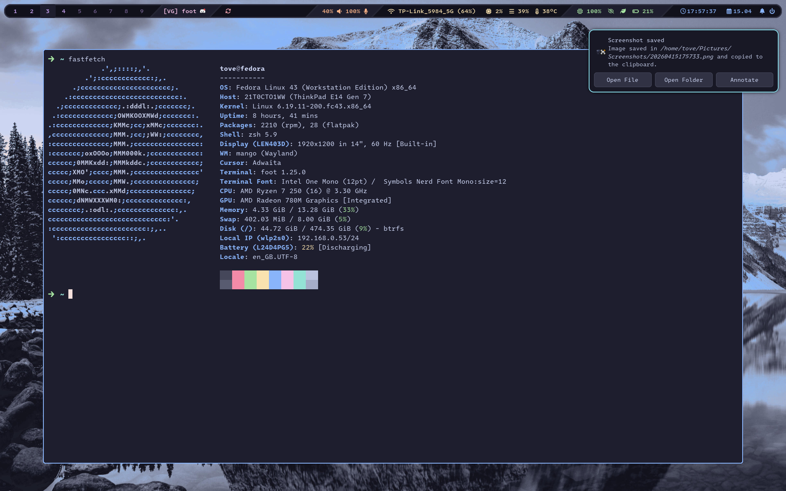

# dotfiles
My personal dotfiles. Built around Mango on Fedora.

## current rice

Color scheme: Catpuccin

# utilities

The tools and utilities I use for my setup. Documented here in case I forget.

- **wm**: mango
- **terminal**: foot
- **shell**: zsh
- **top bar**: waybar
- **notifications**: swaync
- **power management**: tuned
- **lock screen**: swaylock
- **wallpaper**: swaybg *(requires logout to take effect, switch to [awww](https://codeberg.org/LGFae/awww)?)*
- **volume manager**: pamixer
- **brightness manager**: brightnessctl
- **screenshot manager**: [msnap](https://github.com/atheeq-rhxn/msnap?tab=readme-ov-file)
- **battery health**: batctl

# notes

- [ ] Look into [SwayAudioIdleInhibit](https://github.com/ErikReider/SwayAudioIdleInhibit) to inhibit idle when audio is playing
- [ ] Bind microphone mute button
- [ ] Theme swaylock ([this example](https://github.com/RedBorg/dotfiles-sway-island/blob/master/.config/swaylock/lock.sh) is pretty cool)
